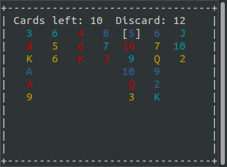

# Johanne's family solitaire

## Rules
The goal is to empty the board by taking off three cards at a time from the same column.

You may only take cards from the ends of one column, and they must add up to either 10, 20 or 30 in value. For example, you could try the bottom three cards, or the bottom card and the two top cards.

Aces are worth 1, and J, Q, K are worth 10.

## Keyboard controls

- [h] Toggle help / keyboard shortcuts
- [q] Quit (without saving)
- [arrow keys] Move the selector
- [enter] Select a card
- [delete] Un-select the last card
- [s] Mix the discard into the draw pile
- [r] Deal a round of cards
- [n] New game
- [z] Show the seed

## Depends
- python 3
- curses
